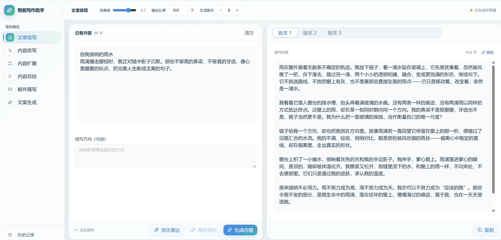
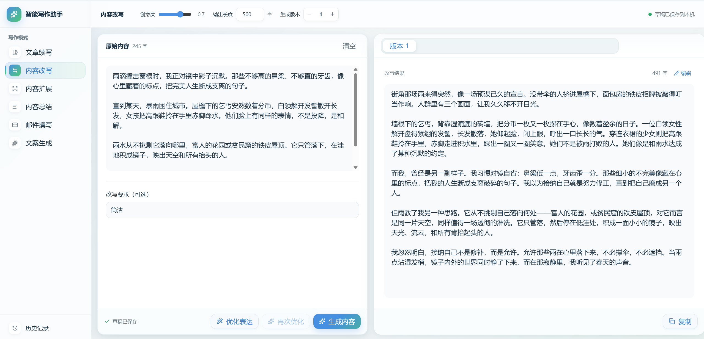
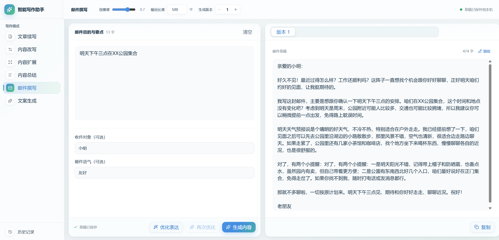
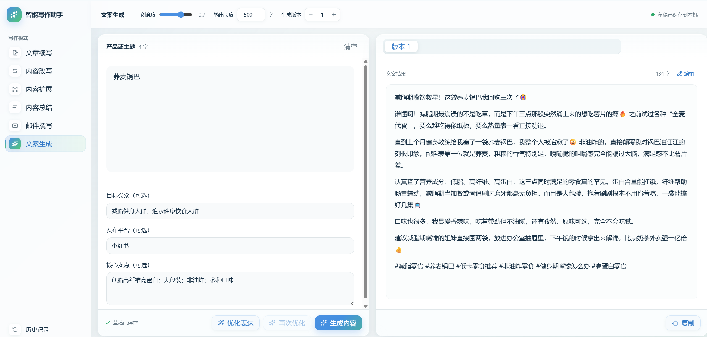

# 智能写作助手

一个面向中文写作场景的 AI 工作台。前端使用 React、TypeScript、Vite 和 Tailwind CSS，后端通过 Express 在服务端调用 DeepSeek，避免将 API Key 暴露到浏览器。

## 功能特性

- 文章续写、内容改写、内容扩展、内容总结、邮件撰写和文案生成六种模式。
- 支持调节创意度、目标长度和生成版本数量。
- 支持输入优化、多版本结果、Markdown 渲染、结果编辑与一键复制。
- 草稿、参数和历史记录保存在当前浏览器的 LocalStorage 中。
- 覆盖桌面、平板和手机视口的响应式界面。
- 内置请求校验、限流、超时重试、部分成功与错误恢复机制。

## 界面预览

### 文章续写



### 内容改写



### 邮件撰写



### 文案生成



## 技术栈

- React + TypeScript + Vite
- Express + Zod
- DeepSeek API
- Vitest + Testing Library + Playwright
- pnpm

## 快速开始

### 环境要求

- Node.js 20 或更高版本
- pnpm 10 或与 `pnpm-lock.yaml` 兼容的版本
- DeepSeek API Key

### 安装

```powershell
pnpm install
Copy-Item .env.local.example .env.local
```

编辑 `.env.local`：

```dotenv
DEEPSEEK_API_KEY=你的服务端密钥
DEEPSEEK_BASE_URL=https://api.deepseek.com
DEEPSEEK_MODEL=deepseek-v4-flash
PORT=8787
```

启动开发环境：

```powershell
pnpm dev
```

- 前端：`http://127.0.0.1:5173`
- API：`http://127.0.0.1:8787`

Vite 会把 `/api` 请求代理到本地 Express 服务。

## API Key 安全

- `.env.local` 和所有 `.env.*` 文件默认被 Git 忽略，仓库只保留不含密钥的 `.env.local.example`。
- API Key 仅由 Express 服务读取，不使用会被打包到浏览器的 `VITE_` 前缀。
- `pnpm build` 会扫描前端构建产物，阻止环境变量名称或本地真实 Key 被打包。
- 生产部署时请在托管平台的服务端环境变量中配置 Key，不要写入源码、README 或前端配置。

如果 Key 曾经被提交到 Git，请立即在 DeepSeek 控制台撤销并重新生成；仅从后续提交中删除并不能清除历史泄露。

## 测试与构建

```powershell
pnpm lint
pnpm typecheck
pnpm test
pnpm test:e2e
pnpm build
```

- `pnpm test` 使用模拟请求运行单元、组件和服务端测试，不消耗 API 配额。
- `pnpm test:e2e` 使用 Playwright 验证桌面、平板与手机视口。
- `pnpm test:smoke` 会调用真实模型，需要先配置 Key 并启动 API 服务。

## 生产运行

```powershell
pnpm build
pnpm start
```

生产模式下，Express 同源提供前端静态文件和 `/api/*` 接口。由于项目包含服务端 API，不能仅用 GitHub Pages 完整运行；请部署到支持 Node.js 服务和私密环境变量的平台，并配置 HTTPS 与适合实际流量的访问控制。

## 数据与隐私

草稿、历史和最近使用的参数只保存在当前浏览器的 LocalStorage 中。服务端不保存用户正文。清除站点数据、使用隐私模式、切换浏览器或设备会导致本地记录不可访问。

## 项目结构

```text
src/          React 页面、组件、状态与本地存储
server/       Express API、安全中间件与 DeepSeek 客户端
shared/       前后端共享类型与 Zod 校验
tests/        Vitest 与 Playwright 测试
scripts/      真实 API 冒烟测试与客户端密钥扫描
docs/images/  README 演示图片
```
